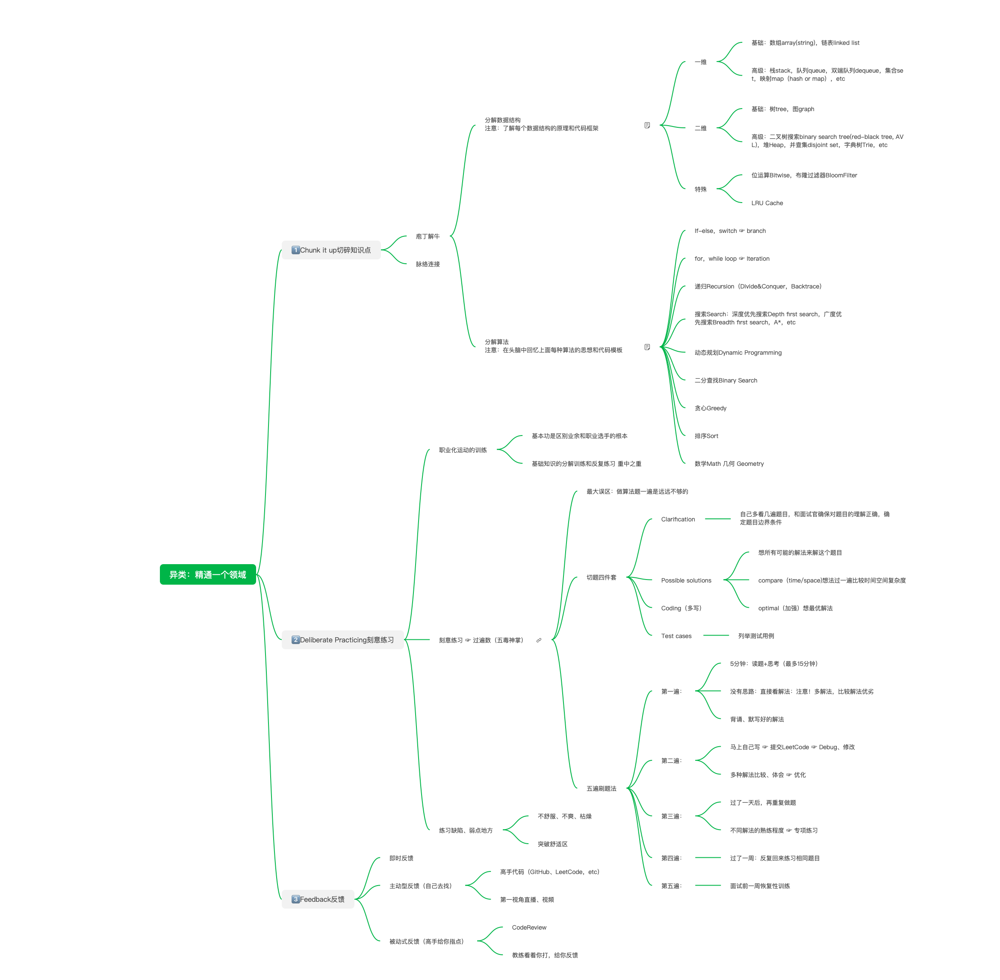
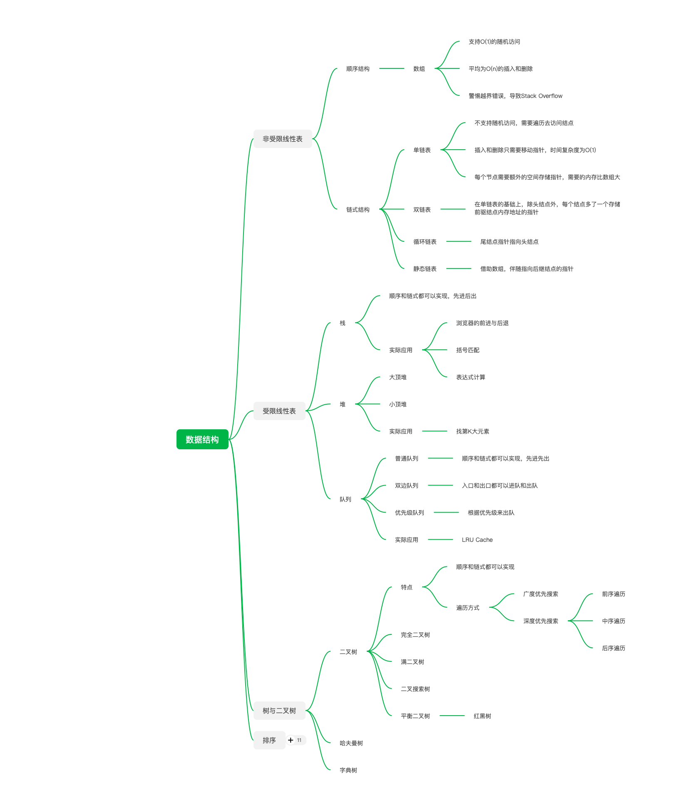
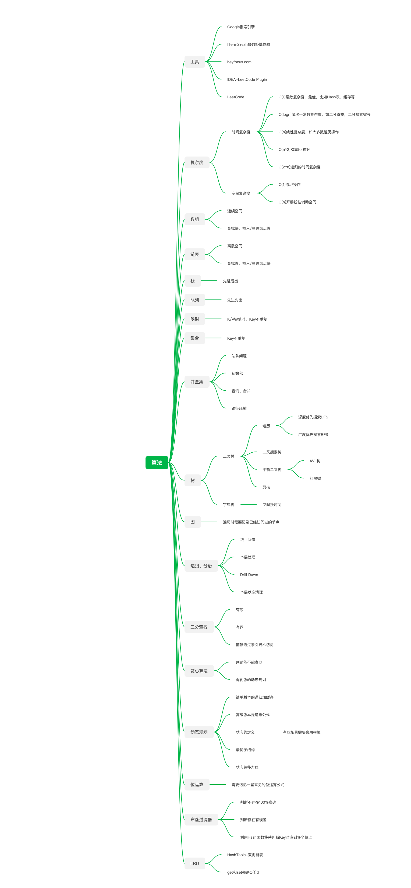

# NOTE

# 学习手册

# 学习理念
- 让优秀的人一起学习
- 师傅领进门，修行靠个人

# 学员精选

- 稻盛和夫“六项精进”
  - 1、付出不亚于任何人的努力
  - 2、要谦虚，不要骄傲
  - 3、要每天反省
  - 4、活着，就要感谢
  - 5、积善行，思利他
  - 6、忘却感性的烦恼
  - 从今天开始，让我们一起啃下这块硬骨头
- 获得正向的反馈，全神贯注的完成一件事情
- 坚持、不断修正自己的学习方法，更加快速进步
- 既然选择了这条路，跪着也要走下去，为了在算法这条路上越走越远，就必须付出超乎常人的努力，只有这样，才能在这个领域站住脚。坚持走下去！
- 课程结束回顾学习过程，会感激今天付出的所有努力！

# 课前准备
> 【关于我】      Custer
> 【关于工作】  持续创业者，创业第四年了，专注于向培训机构提供少儿编程课程及系统支持服务
> 【工作之外】  学习Go语言和微服务领域知识
> 【给我 10 分钟，我希望与你分享…】1. 希望以后可以和自己的孩子一起学习数据结构与算法，一起做很多很多个技术玩具(不能称之为产品)

# 概览

# 数据结构思维导图

# 算法思维导图
